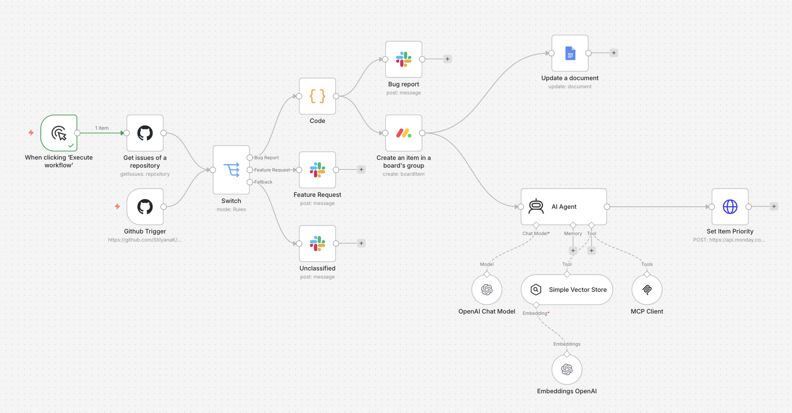

# n8n AI-Powered Bug Management Agent

An intelligent automation workflow built with **n8n** that triages GitHub issues, routes bug reports, sends Slack notifications, creates Monday.com tasks, updates documentation and uses an AI Agent to analyze priority and on-call assignment.

Built while learning advanced n8n automation concepts through Educative.

---

## Project Overview

This project demonstrates a production-style **AI-powered issue manage workflow** built in n8n.

The workflow monitors GitHub issues and classifies them based on labels.

It processes bug reports, sends Slack notifications, creates tracking tasks in Monday.com and updates a Google Docs incident log.

The AI Agent analyzes issue priority, searches for related issues and retrieves the current on-call engineer.

The goal of this project is to showcase how n8n can be used to connect developer tools, AI services and team communication platforms into one automated workflow.

---

## What This Workflow Does

The workflow automates the triage process for GitHub issues:

1. A GitHub issue is received through a GitHub Trigger or manual execution.
2. A Switch node classifies issues based on labels.
3. Bug reports are processed with custom JavaScript logic.
4. Structured Slack notifications are generated using Block Kit.
5. Tracking tasks are created in Monday.com.
6. A Google Docs incident log is updated automatically.
7. The AI Agent analyzes issue priority, checks for similar issues, and retrieves the current on-call engineer.

---

## Tools and Technologies

* **n8n** - workflow automation platform
* **GitHub** - issue source and trigger
* **Slack** - team notifications
* **Monday.com** - task and triage tracking
* **Google Docs** - bug report logging
* **OpenAI** - AI Agent reasoning and embeddings
* **MCP Client** - external tool integration
* **JavaScript** - custom issue formatting logic
* **Vector Store** - semantic search for similar issues

---

## Workflow Architecture

The workflow is organized into several logical stages.

### 1. GitHub Input

The workflow starts from a GitHub Trigger or manual execution.

### 2. Issue Classification

A Switch node classifies GitHub issues and routes them into dedicated processing flows.

### 3. Bug Report Processing

A JavaScript Code node extracts and transforms issue metadata for downstream automation steps and Slack formatting.

### 4. Team Notification

Structured Slack notifications are generated using Block Kit message formatting.

### 5. Task Tracking

A Monday.com item is created to track issue status and ownership.

### 6. Documentation Update

A Google Docs document is updated with a short bug summary and task reference.

### 7. AI Manager

The AI Agent reviews the bug title and body, searches for similar issues, estimates priority and retrieves the current on-call engineer using an MCP tool.

---

## 📂 Repository Structure

```text
n8n-ai-powered-bug-management-agent/
│
├── workflow/
│   ├── ai-powered-bug-management-agent.json
│   └── ai-agent-screenshot.png
│
├── README.md
└── .gitignore
```

---

## 📸 Screenshot

The screenshot below shows the full n8n workflow layout, including the GitHub trigger, issue routing, Slack notification path, Monday.com integration, Google Docs update, AI Agent, OpenAI model, vector store, embeddings and MCP Client.



---

## How to Import the Workflow in n8n

1. Open your n8n instance.
2. Go to **Workflows**.
3. Click **Import from File**.
4. Select `ai-powered-bug-management-agent.json` from this repository.
5. Open the imported workflow.
6. Configure your own credentials for:

    * GitHub
    * Slack
    * Monday.com
    * Google Docs
    * OpenAI
    * MCP Header Auth
7. Replace all placeholder values with your own environment-specific values.
8. Test the workflow manually before activating it.

---

## Security Note

This repository contains a sanitized workflow export.

All credentials, IDs, webhook values and environment-specific information were removed or replaced with placeholders before publishing.

---
